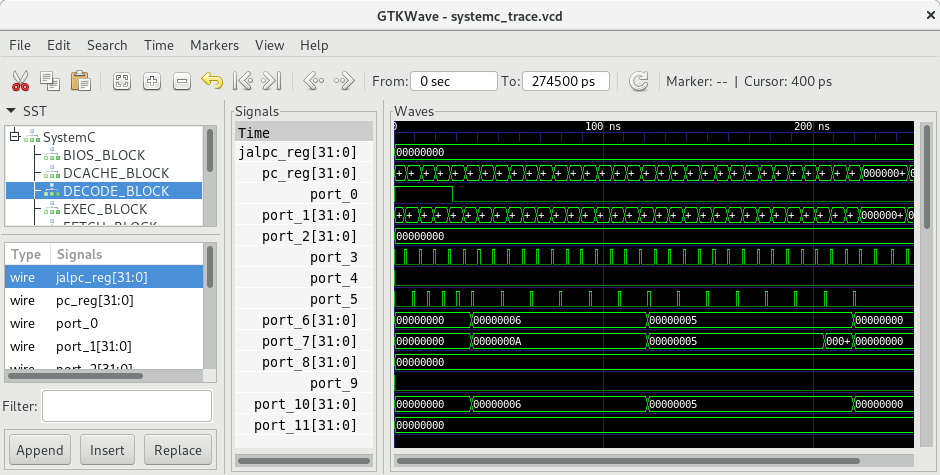

# gdb_systemc_trace
GDB Python scripts for SystemC design introspection and tracing

Automatically creates a trace of all signals and module member variables in design


### Limitations
Fixed-point datatypes are not supported yet


## Installation

### Prerequisites
* GDB 8.2 configured with Python scripting support https://www.gnu.org/software/gdb/download/
* libstdc++ pretty printers initialized with .gdbinit https://sourceware.org/gdb/wiki/STLSupport
* Python : to run top-level gdb_systemc_trace.py script
* SystemC 2.3.3 built as .so library with debuginfo (see below)

### Running basic example
1. clone gdb_systemc_trace from git and add to $PATH
2. Download SystemC 2.3.3 https://accellera.org/downloads/standards/systemc
3. Build with debug info:
    ```
    $ tar xvf systemc-2.3.3.tar.gz 
    $ cd systemc-2.3.3/
    $ mkdir build_debug
    $ cd build_debug/
    $ cmake ../ -DCMAKE_BUILD_TYPE=Debug -DCMAKE_CXX_STANDARD=14
    $ make -j8
    # build SystemC examples
    $ make check -j8
    # it is important to cd into example directory, sometimes they read some files from workdir
    $ cd examples/sysc/risc_cpu
    $ gdb_systemc_trace.py risc_cpu
    # systemc_trace.vcd file will be created
    ```
4. Use GTKWave or other VCD viewer to view generated vcd:
```
 $ gtkwave systemc_trace.vcd 
```




## Running simulation with full trace dump

* ./gdb_systemc_trace.py path/to/your/simulation_executable
* systemc_trace.vcd will be created
* Use vcd_hierarchy_manipulator to create hierarchical VCDs: https://github.com/yTakatsukasa/vcd_hierarchy_manipulator
* Use GtkWave to view vcd waveform : http://gtkwave.sourceforge.net/

## Tracing only required signals

* ./gdb_systemc_trace.py -l path/to/your/simulation_executable
* List of all detected signals in design will be printed to console
* Copy required signal names (full hierarchical names) into some file, say signals.txt
* ./gdb_systemc_trace.py -f signals.txt
* systemc_trace.vcd will be created

## Print design tree
* ./gdb_systemc_trace.py -p path/to/your/simulation_executable

## Passing arguments to simulation executable
* ./gdb_systemc_trace.py  path/to/your/simulation_executable argument_1 argument_2 ...
